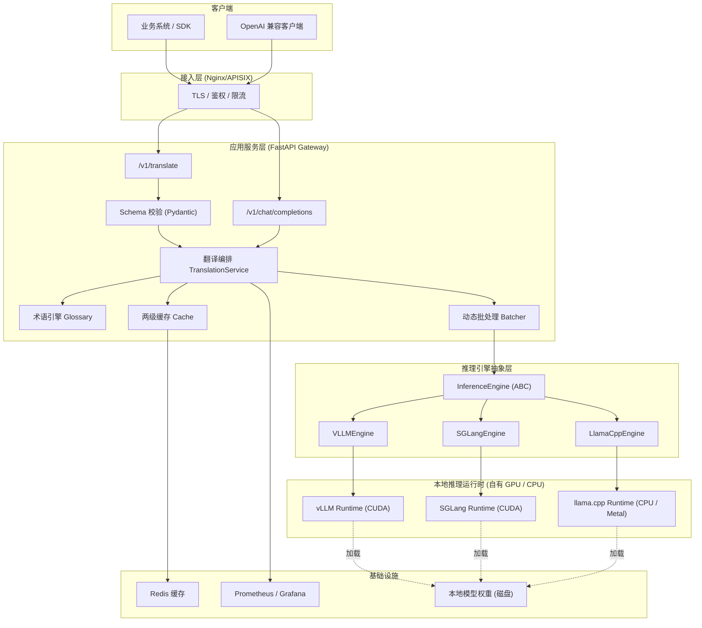

# 翻译大模型私有化部署 · 架构设计文档

> 版本：v1.0
> 状态：设计评审稿（Design Review）
> 适用范围：本地化 / 私有化（On-Premise）机器翻译服务
> 关键词：开源模型、vLLM、SGLang、自托管、无云端代理、OpenAI 兼容

---

## 0. 文档导读

本文档为「翻译大模型私有化部署」项目的第一阶段交付物，仅包含**架构设计**，不包含最终可运行代码。

全文篇幅分配（符合"技术选型对比 + 代码架构占比 ≥ 80%"的要求）：

| 章节 | 内容 | 篇幅占比 |
| --- | --- | --- |
| 第 1 章 | 需求与约束（简要） | ≈ 5% |
| 第 2 章 | **技术选型对比** | ≈ 45% |
| 第 3 章 | **代码架构设计** | ≈ 40% |
| 第 4 章 | 部署 / 性能 / 测试 / 风险 | ≈ 10% |

**硬性约束（来自需求方）**：

1. 必须使用 Hugging Face 等公开渠道的**开源模型**（示例基准：`Qwen/Qwen2.5-1.5B-Instruct`）。
2. 所选模型必须同时被当前主流推理框架支持（**vLLM / SGLang** 等）。
3. **严禁**出现"httpClient 二道贩子"——即把客户端请求直接代理转发到云厂商 API 的实现。
4. 先出架构设计文档，其中技术选型对比、代码架构占比 ≥ 80%。

---

## 名词解释（阅读前置）

> 本文涉及较多大模型 / 推理 / 运维领域术语，为方便非算法背景的观众阅读，先集中解释。正文首次出现处不再重复展开。

### A. 模型与翻译基础

| 名词 | 英文 / 缩写 | 通俗解释 |
| --- | --- | --- |
| 大语言模型 | LLM, Large Language Model | 用海量文本训练出的通用生成模型，能对话、写作、翻译等。本文用它做翻译。 |
| 机器翻译 | MT / NMT | Machine Translation / Neural MT，用神经网络把一种语言自动翻译成另一种语言。 |
| Encoder-Decoder | 编码器-解码器 | 早期翻译模型结构：先"读懂"源句（编码），再"写出"译文（解码）。如 Marian、NLLB。 |
| 权重 | Weights | 模型训练后保存的参数文件（几十 MB ~ 几十 GB）。**私有化的本质就是把权重放在自己机器上。** |
| 开源模型 | Open-source Model | 权重与许可公开、可下载自部署的模型。本文要求必须来自 Hugging Face 等公开渠道。 |
| Hugging Face | HF | 全球最大的开源模型托管平台，形如"AI 界的 GitHub"。 |
| 许可 / 授权 | License | 模型的使用法律条款。如 `Apache-2.0`（可商用）、`CC-BY-NC`（**禁商用**）。选型的关键红线之一。 |
| Prompt | 提示词 | 喂给模型的指令文本。本文用固定 System Prompt 来约束翻译行为。 |
| System Prompt | 系统提示词 | Prompt 中固定不变的角色设定部分（如"你是专业翻译，只输出译文"）。翻译场景中它不变，可被缓存复用。 |
| Chat Template | 对话模板 | 把 messages 拼成模型认识的字符串的规则，各模型不同，需按官方模板渲染。 |
| 术语表 | Glossary | 用户指定的"必须这样翻译"的对照词表（如 "GPU → 图形处理器"），用于强制译法一致。 |
| 分词 / Token | Tokenizer / Token | 模型处理的最小文本单元。一个汉字≈1~2 token，一个英文单词≈1~3 token。**计费、限长、吞吐都以 token 计量。** |
| 领域微调 | Fine-tuning / LoRA | 用领域数据继续训练模型以提升特定场景效果。LoRA 是一种轻量微调方法，可热加载。 |

### B. 推理与性能

| 名词 | 英文 / 缩写 | 通俗解释 |
| --- | --- | --- |
| 推理 | Inference | 模型"使用"的过程（区别于"训练"）：输入 Prompt，输出结果。 |
| 推理框架 | Inference Engine | 专门用于高效跑推理的软件（如 vLLM、SGLang），负责调度、批处理、显存管理。 |
| 吞吐 | Throughput | 单位时间能产出的 token 数（tokens/s）。越高越省钱。 |
| 延迟 | Latency | 一次请求从发出到返回的耗时。常用 P50/P95/P99 表示分位数（P95=95% 的请求快于该值）。 |
| 并发 | Concurrency | 同时处理的请求数量。 |
| QPS | Queries Per Second | 每秒请求数。 |
| 显存 | VRAM | GPU 上的内存。模型越大、批次越多，占用越高。是部署选型的硬约束。 |
| KV Cache | 键值缓存 | 模型生成时缓存的中间计算结果，避免重复计算历史 token。**占显存大头。** |
| 前缀缓存 | Prefix Caching / APC | 当多个请求开头（如前缀固定的 System Prompt）相同时，复用已算好的 KV，省时省显存。翻译场景收益极大。 |
| RadixAttention | — | SGLang 的前缀缓存实现，用基数树组织，对"固定前缀 + 多变后缀"命中率更高。 |
| PagedAttention | — | vLLM 首创的显存分页管理技术，像操作系统管理内存一样管理 KV Cache，大幅提升利用率。 |
| 连续批处理 | Continuous Batching | 不等整批结束，动态把新请求插入正在跑的批次，显著提升吞吐。 |
| 冷启动 | Cold Start | 服务刚启动、模型还没加载进显存、首个请求较慢的阶段。 |
| 流式输出 | Streaming | 边生成边返回（逐字/逐句），改善长文本等待体验。 |
| 结构化输出 | Structured Output / Guided Decoding | 强制模型按 JSON / 正则等格式输出，便于程序解析。 |
| 状态机 | FSM | Finite State Machine，实现"受约束解码"的底层机制，保证输出合法。 |

### C. 推理框架专有名词

| 名词 | 通俗解释 |
| --- | --- |
| vLLM | 最主流的开源高吞吐推理框架，生态最全，本文**默认引擎**。 |
| SGLang | 另一主流高性能框架，前缀缓存（RadixAttention）与结构化输出更强，本文**可选引擎**。 |
| TensorRT-LLM | NVIDIA 官方推理框架，性能极致但需编译、运维重。 |
| TGI | Hugging Face 官方推理服务（Text Generation Inference）。 |
| llama.cpp | 面向 CPU / 边缘设备的高效推理实现，量化格式为 GGUF。 |
| Ollama | 基于 llama.cpp 的"一键跑模型"工具，**面向开发体验，非生产级**。 |
| GGUF | llama.cpp 使用的量化模型格式。 |

### D. 量化（省显存/提速度）

| 名词 | 通俗解释 |
| --- | --- |
| 量化 | Quantization，把模型参数用更低精度存储（如 16 位→4 位），**省显存、更快，但可能轻微掉点**。 |
| FP16 | 16 位浮点，原始精度，质量最好、最占显存。 |
| FP8 / INT8 | 8 位量化，显存约减半，质量损失小；FP8 需较新（Ada/Hopper）显卡。 |
| AWQ | 一种 4 位量化方法，消费级显卡友好，社区权重现成。本文**消费卡推荐**。 |
| GPTQ | 另一种 4 位量化方法，效果与 AWQ 相当。 |
| bitsandbytes | 训练友好的量化库，推理场景不推荐。 |

### E. 服务与接口

| 名词 | 通俗解释 |
| --- | --- |
| FastAPI | Python 异步 Web 框架，开发快、自带接口文档，本文**应用网关选型**。 |
| Pydantic | Python 数据校验库，用于校验请求/响应字段。 |
| SSE | Server-Sent Events，一种 HTTP 流式推送协议，用于流式输出。 |
| gRPC | 基于 HTTP/2 的高性能 RPC 协议，本文列为内部通信备选。 |
| Triton | NVIDIA 的推理服务器，适合多模型编排，本文列为平台化演进项。 |
| OpenAI 兼容 | 接口协议对齐 OpenAI 的 `/v1/chat/completions` 格式，**只是协议兼容，不代表调用 OpenAI 云服务**。 |
| 二道贩子 | 本文红线词：服务端不跑模型，只把请求转发给云厂商 API 的实现。详见 §2.2.4 判定标准。 |
| 网关 | Gateway，流量的统一入口，负责鉴权、限流、路由。 |
| 限流 / 令牌桶 | Rate Limit / Token Bucket，控制单位时间请求量，超限返回 429。 |
| 背压 | Backpressure，下游处理不过来时，反向抑制上游流量，避免雪崩。 |
| 熔断 / 降级 | Circuit Breaker / Degradation，依赖故障时快速失败或走保底逻辑。 |
| 缓存 LRU | Least Recently Used，淘汰最久未用项的内存缓存策略。 |

### F. 部署与运维

| 名词 | 通俗解释 |
| --- | --- |
| 私有化 / 本地化部署 | On-Premise，模型与数据都在自己机房/内网，**数据不出内网**，可离线运行。 |
| Docker / 镜像 | 容器化打包工具，把环境和代码打包成可移植的"镜像"。 |
| Docker Compose | 单机多容器编排工具，本文**阶段一**采用。 |
| Kubernetes（K8s） | 多机容器编排平台，支持 GPU 调度与弹性扩缩，本文**阶段二**采用。 |
| GPU Operator | K8s 上管理 GPU 驱动的组件。 |
| HPA / KEDA | K8s 的自动扩缩容组件（按负载/事件伸缩）。 |
| PVC | Persistent Volume Claim，K8s 的持久化存储声明，用于挂载模型权重。 |
| Redis | 高性能内存数据库，本文用作**二级缓存**。 |
| Prometheus / Grafana | 指标采集 / 可视化监控组合。 |
| Loki / ELK | 日志聚合方案（Loki 轻量；ELK=Elasticsearch+Logstash+Kibana）。 |
| OpenTelemetry | 开源链路追踪标准。 |
| 张量并行 / 流水并行 / 专家并行 | TP / PP / EP，把大模型切分到多张卡上的三种并行方式。 |

### G. 评测与合规

| 名词 | 通俗解释 |
| --- | --- |
| BLEU | 机器翻译经典自动评测指标（0~100），越高越好，但仅供参考。 |
| COMET | 基于神经网络的翻译质量评测指标，比 BLEU 更贴近人工判断。 |
| 回归测试 | 改动后重跑测试，确认原有能力没变差。 |
| 出网 / 离线运行 | 是否需要访问外网。本项目要求**全程离线**，无任何外部依赖。 |

---

## 1. 需求与约束（简要）

### 1.1 功能需求

| 编号 | 需求 | 说明 |
| --- | --- | --- |
| F1 | 文本翻译 | 支持 中 ↔ 英 双向翻译，可扩展至多语种 |
| F2 | 术语约束 | 支持用户自定义术语表（Glossary），强制译法一致 |
| F3 | 批量翻译 | 支持一次请求多段文本（数组入参），用于文档级翻译 |
| F4 | OpenAI 兼容接口 | 暴露 `/v1/chat/completions`，方便存量客户端零改造接入 |
| F5 | 结构化输出 | 输出 JSON（译文 + 术语命中 + 置信度）可选 |
| F6 | 流式输出 | 支持 SSE 流式返回，改善长文本体验 |

### 1.2 非功能需求

| 编号 | 指标 | 目标值 |
| --- | --- | --- |
| N1 | 单卡吞吐 | ≥ 800 tokens/s（1.5B，AWQ 4bit，单张 4090/A10） |
| N2 | P95 延迟 | 单句（≤128 token）< 800ms |
| N3 | 并发 | ≥ 64 并发连接稳定服务 |
| N4 | 数据合规 | 数据**不出内网**，无任何外部网络依赖（离线可运行） |
| N5 | 可移植 | 同一模型产物可在 vLLM 与 SGLang 之间切换 |
| N6 | 可观测 | 暴露 Prometheus 指标 + 结构化日志 |
| N7 | 运行平台 | **Linux x86_64 + NVIDIA GPU（CUDA）**；不支持 macOS/Windows（见 §2.2.5） |

### 1.3 明确"不做什么"（反需求 / Non-Goals）

> **反需求 R1（核心红线）：不实现任何形态的云端 API 代转发。**
>
> 具体判定标准（满足任一即为违规）：
> - 代码中出现指向公有云域名（如 `*.openai.com`、`*.aliyuncs.com`、`*.volces.com` 等）的出网请求；
> - 服务端仅做 `request → httpClient.forward() → cloud` 的透传，而无本地模型加载；
> - 部署后需要连接外网才能完成推理。
>
> **合规的"代理/适配"与"二道贩子"的区别**见 §2.2.4。

### 1.4 术语表

| 术语 | 含义 |
| --- | --- |
| 二道贩子 | 服务端不持有模型，仅把请求转发给云厂商 API 的实现方式 |
| Continuous Batching | 连续批处理，vLLM/SGLang 的核心吞吐优化 |
| Prefix Caching | 前缀 KV 缓存复用，翻译场景因 System Prompt 固定收益极高 |
| AWQ / GPTQ / FP8 | 权重量化方案 |
| OpenAI 兼容 | 接口协议对齐 `/v1/chat/completions`，本身不代表调用 OpenAI 云服务 |

---

## 2. 技术选型对比（核心章节）

> 本章为文档主体，逐层完成「模型 → 推理框架 → 服务框架 → 量化 → 部署 → 网关」的选型决策。

### 2.1 模型选型

#### 2.1.1 候选模型矩阵

| 模型 | 参数量 | 类型 | 许可 | vLLM 支持 | SGLang 支持 | 中英翻译质量 | 商用友好 |
| --- | --- | --- | --- | --- | --- | --- | --- |
| **Qwen/Qwen2.5-1.5B-Instruct** | 1.5B | 通用 LLM | Apache-2.0 | ✅ | ✅ | 良好 | ✅ 最佳 |
| Qwen/Qwen2.5-7B-Instruct | 7B | 通用 LLM | Apache-2.0 | ✅ | ✅ | 优秀 | ✅ |
| Qwen/Qwen2.5-3B-Instruct | 3B | 通用 LLM | Apache-2.0（研究）| ✅ | ✅ | 良好+ | ⚠️ 需确认 |
| Helsinki-NLP/opus-mt-zh-en | ~74M | 专用 NMT | CC-BY-4.0 | ⚠️ 需封装 | ❌ 非 LLM 架构 | 一般（单句佳） | ✅ |
| facebook/nllb-200-distilled-600M | 600M | 专用 NMT | CC-BY-NC-4.0 | ⚠️ | ❌ | 良好 | ❌ 非商用 |
| google/gemma-2-2b-it | 2B | 通用 LLM | Gemma License | ✅ | ✅ | 良好 | ⚠️ 有附加条款 |
| meta-llama/Llama-3.2-3B-Instruct | 3B | 通用 LLM | Llama 3.2 社区许可 | ✅ | ✅ | 良好 | ⚠️ 有条件 |
| Unbabel/TowerInstruct-7B | 7B | 翻译专用 LLM | 研究许可 | ✅ | ⚠️ | 优秀（翻译向）| ⚠️ |

#### 2.1.2 关键维度分析

**A. 为什么不用专用 NMT 模型（Marian / NLLB）？**

- 优点：体积小、单句延迟低、CPU 也能跑。
- 缺点：
  - `nllb` 系列为 **CC-BY-NC**（禁止商用），直接触碰合规红线；
  - `opus-mt` 为单向（zh→en 与 en→zh 是两个独立模型），多语种部署成本线性增长；
  - 不满足约束 2 中"主流 LLM 推理框架（vLLM/SGLang）原生支持"的定义——它们是 Encoder-Decoder，社区支持弱、量化生态差；
  - 无法通过 Prompt 实现**术语约束、风格控制、结构化输出**，扩展性差。

**B. 为什么以 Qwen2.5 系列为基线？**

- **许可友好**：`Apache-2.0`，可商用、可二次分发，无附加条款；
- **框架原生支持**：Qwen 系列是 vLLM/SGLang 的**一等公民**，官方持续适配，量化权重（AWQ/GPTQ/FP8）在 HF 上有现成产物；
- **中文能力强**：中文语料占比高，中英互译优于同规模 Llama/Gemma；
- **参数梯度完整**：1.5B / 3B / 7B 同族，可"同一套代码，按算力切换模型"，升级路径平滑；
- **生态成熟**：chat template、tokenizer、工具调用均标准化。

**C. 1.5B vs 7B 的取舍**

| 维度 | 1.5B | 7B |
| --- | --- | --- |
| 显存（FP16） | ~3.2GB | ~15GB |
| 显存（AWQ 4bit） | ~1.5GB | ~5.5GB |
| 单卡部署 | 消费级即可 | 需 12GB+ |
| 翻译质量 | 通用句 良好 | 长难句 优秀 |
| 吞吐 | 高 | 中 |
| 定位 | **在线高并发 / 边缘** | **离线高质量 / 文档** |

#### 2.1.3 选型结论（模型）

> **主选：`Qwen/Qwen2.5-1.5B-Instruct`**（满足需求方示例基准，Apache-2.0，vLLM/SGLang 双支持）。
> **备选/升级：`Qwen/Qwen2.5-7B-Instruct`**（同代码栈，质量优先场景）。
> **架构要求：模型层做可配置化（`model.yaml` + Engine 抽象），禁止在业务代码中硬编码模型名。**

### 2.2 推理框架选型

#### 2.2.1 候选框架矩阵

| 维度 | **vLLM** | **SGLang** | TensorRT-LLM | TGI | llama.cpp | Ollama |
| --- | --- | --- | --- | --- | --- | --- |
| 定位 | 通用高吞吐 | 高吞吐+结构化 | NVIDIA 极致性能 | HF 官方 | CPU/边缘 | 开发便捷 |
| Continuous Batching | ✅ | ✅ | ✅ | ✅ | ❌ | ⚠️ |
| PagedAttention | ✅（首创） | ✅（改进） | ✅ | ✅ | ❌ | ❌ |
| 前缀缓存 | ✅ APC | ✅ **RadixAttention** | ✅ | ✅ | ✅ | ✅ |
| 结构化输出 | ✅ guided/outlines | ✅ **压缩 FSM** | ✅ | ⚠️ | ⚠️ | ⚠️ |
| 量化和类 | AWQ/GPTQ/FP8/INT8/INT4 | AWQ/GPTQ/FP8/INT4 | FP8/INT8/INT4/AWQ | AWQ/GPTQ/EETQ/bnb | GGUF | GGUF |
| LoRA 热加载 | ✅ | ✅ | ✅ | ⚠️ | ✅ | ⚠️ |
| OpenAI 兼容 | ✅ | ✅ | ✅ | ✅ | ✅ | ✅ |
| 多卡/分布式 | TP/PP | TP/DP/EP | TP/PP | TP | ❌ | ❌ |
| 部署复杂度 | 低 | 中 | **高（需编译）** | 低 | 低 | 极低 |
| 生产成熟度 | **高** | 高 | 高 | 中 | 低（服务化） | **不建议生产** |
| 首次冷启动 | 中 | 中 | **长** | 中 | 低 | 低 |
| 社区活跃度 | **极高** | 高（增长快）| 高 | 高 | 极高 | 极高 |
| **操作系统支持** | **Linux（需 CUDA）** | **Linux（需 CUDA）** | Linux（需 CUDA） | Linux / Docker | **跨平台（含 macOS/Win）** | **跨平台（含 macOS/Win）** |
| **macOS / Apple Silicon 原生** | ❌ 不支持 | ❌ 不支持 | ❌ 不支持 | ❌ 不支持 | ✅（CPU / Metal） | ✅（CPU / Metal） |
| **Windows** | ⚠️ 仅 WSL2 | ⚠️ 仅 WSL2 | ⚠️ 实验性 | ⚠️ 仅 Docker | ✅ | ✅ |
| **是否必须 NVIDIA GPU** | **必须** | **必须** | **必须** | 推荐 | 否（可纯 CPU） | 否（可纯 CPU） |

#### 2.2.2 逐项分析

**vLLM**

- 优势：PagedAttention + Continuous Batching 行业事实标准；模型覆盖最广；OpenAI Server 开箱即用；量化与 LoRA 生态最全；稳定、文档好、排障资料多。
- 劣势：前缀缓存（APC）在复杂共享前缀场景略逊于 SGLang 的 RadixAttention；结构化输出生成性能一般。
- 适用：**本项目主推理引擎**，稳字优先。

**SGLang**

- 优势：**RadixAttention** 对"固定 System Prompt + 多变 User 输入"场景 KV 复用命中率极高——**这正好是翻译服务的典型流量形态**；压缩 FSM 结构化输出性能强；`sglang.Engine` 既支持嵌入进程，也支持独立 Server。
- 劣势：相对 vLLM 生态稍新；部分边缘模型适配滞后。
- 适用：**本项目备选/高吞吐引擎**，尤其批处理离线翻译。

**TensorRT-LLM**

- 优势：NVIDIA 卡上延迟/吞吐理论最优。
- 劣势：需要模型编译引擎（`trtllm-build`），迭代慢、运维重、对模型改动敏感。
- 结论：**本阶段不选**，列为后续性能极致优化项。

**TGI / llama.cpp / Ollama**

- TGI：功能与生态弱于 vLLM，无差异化优势，不选为主。
- llama.cpp：**跨平台（Linux / macOS / Windows），支持纯 CPU 或 Metal/CUDA 加速**，使用 GGUF 权重；
  **本版本已接入为第三个进程内引擎**，用于"无 NVIDIA GPU / macOS 开发机 / 边缘部署"。
  代价：无 PagedAttention 与 Continuous Batching，吞吐低于 vLLM/SGLang，适合低并发或离线翻译。
- Ollama：面向开发体验，非生产级并发，**仅用于本地联调，不用于线上**。

#### 2.2.3 选型结论（推理框架）

> **采用「三引擎 + 统一抽象」策略：**
>
> | 引擎 | 定位 | 平台 | 权重 |
> | --- | --- | --- | --- |
> | **vLLM**（默认） | 生产在线服务，高吞吐 | Linux + NVIDIA CUDA | HF / AWQ / FP8 |
> | **SGLang** | 高前缀复用场景（契合翻译流量形态） | Linux + NVIDIA CUDA | HF / AWQ / FP8 |
> | **llama.cpp** | 跨平台兜底：macOS / 无 GPU / 边缘 | Linux / macOS / Windows | **GGUF** |
>
> - 通过 §3.4 的 [`InferenceEngine`](deploy/translation-serving/app/engine/base.py) 抽象层，同一份业务代码可在三引擎间切换，
>   **满足约束 2"同时满足主流框架"**；配置层 `EngineName` = `Literal["vllm", "sglang", "llamacpp"]`。

> **⚠️ 平台限制（重要）**：vLLM / SGLang / TensorRT-LLM 均只支持 **Linux + NVIDIA GPU（CUDA）**，
> **不支持 macOS（含 Apple Silicon）**。在 macOS 上执行 `pip install vllm` 没有预编译 wheel，
> 会回退到源码编译并失败（日志特征为 `VLLM_TARGET_DEVICE automatically set to cpu due to macOS`）。
> **macOS / 无 GPU 场景请改用 llama.cpp**（跨平台，详见 §2.2.5）。

#### 2.2.4 【红线判定】代理适配 vs 二道贩子

架构中确实存在"客户端 → 本地服务 → 推理引擎"的两跳，必须明确其与违规行为的边界：

| 对比项 | ❌ 二道贩子（违规） | ✅ 本项目（合规） |
| --- | --- | --- |
| 推理位置 | 云厂商服务器 | **本机 / 本集群 GPU** |
| 模型归属 | 云端，服务端无权重 | **本地持有开源权重** |
| 是否出网 | 必须出网 | **全离线，无外网依赖** |
| 成本模型 | 按 token 付费给云 | 一次性算力成本 |
| 数据流向 | 数据离开内网 | **数据不出内网** |
| 代码特征 | `httpx.post("https://api.openai.com/...")` | `from vllm import LLM` / 本机 `localhost:8001` |

> **判定口诀：看"推理发生在哪里"和"模型权重在哪里"。** 只要推理发生在自有 GPU、权重落在本地磁盘，则对本地引擎的 HTTP 调用属于**内部通信**，不构成二道贩子。
> 进一步地，本设计**优先采用进程内嵌（Pattern A）**，连本地 HTTP 都省掉，从代码层面杜绝误判。

#### 2.2.5 运行环境要求（平台 / GPU / Python）

三个引擎的平台要求不同，按目标环境选择：

| 项 | vLLM / SGLang | llama.cpp |
| --- | --- | --- |
| **操作系统** | **Linux x86_64**（不支持 macOS/Windows，Win 仅 WSL2 实验） | **Linux / macOS / Windows 全支持** |
| **加速硬件** | **必须 NVIDIA GPU（CUDA 12.x）** | CPU 可用；GPU 加速支持 **Metal(macOS)** / CUDA / Vulkan |
| **权重格式** | HF 目录 / AWQ / FP8 | **GGUF**（量化内嵌，如 Q4_K_M） |
| **显存/内存（1.5B）** | AWQ 4bit ≈ 2~3 GB；FP16 ≈ 4 GB | Q4_K_M ≈ 1.2 GB |
| **吞吐** | 高（PagedAttention + Continuous Batching） | 中低（无 Continuous Batching） |
| **Python** | 3.10 ~ 3.12（推荐 3.12） | 3.10 ~ 3.13 |
| **macOS（Apple Silicon）** | ❌ **不可运行** | ✅ **可运行**（Metal 加速或纯 CPU） |

**推荐部署路径：**

1. **Linux GPU 主机（生产首选）**：`pip install vllm`（或 `pip install "sglang[all]"`）后直接运行本服务；
2. **Docker（Linux GPU 主机）**：使用 [`docker/Dockerfile.gateway`](deploy/translation-serving/docker/Dockerfile.gateway)，基于 `vllm/vllm-openai` 官方镜像（自带 CUDA 运行时）；
3. **macOS / 无 NVIDIA GPU（开发机、边缘）**：`pip install llama-cpp-python` + GGUF 权重，设置 `engine: llamacpp`
   （macOS 上 `n_gpu_layers: -1` 启用 Metal 加速，纯 CPU 用 `0`）。

> 说明：在 macOS 上**请勿**执行 `pip install vllm`（必然失败）；改用 llama.cpp 即可在本机完整跑通服务。
> 另外，**不同引擎所需的权重产物格式不同**（HF 目录 / AWQ / GGUF），详见 §2.2.6。

#### 2.2.6 模型产物差异（不同引擎需要不同的权重文件）

**同一个模型，不同引擎要准备的"权重产物"并不相同**，这是选型后最容易踩坑的一环。
`configs/model.yaml` 的 `model_path` 必须与 `engine` 匹配，否则启动即报错。

| 引擎 | 权重产物形态 | `model_path` 指向 | 典型 HF 仓库 | `quantization` 字段 |
| --- | --- | --- | --- | --- |
| vLLM / SGLang（FP16） | HF 目录：`config.json` + `*.safetensors` + tokenizer 文件 | **目录** | `Qwen/Qwen2.5-1.5B-Instruct` | `null` |
| vLLM / SGLang（AWQ） | HF 目录 + AWQ 量化权重（含量化配置） | **目录** | `Qwen/Qwen2.5-1.5B-Instruct-AWQ` | `awq` |
| vLLM / SGLang（FP8） | HF 目录 + FP8 量化权重 | **目录** | 视模型而定 | `fp8` |
| **llama.cpp** | **单个 `.gguf` 文件**（量化已内嵌于文件） | **文件（.gguf）** | `Qwen/Qwen2.5-1.5B-Instruct-GGUF` | **无效（被忽略）** |

**关键差异点：**

1. **目录 vs 文件**：vLLM / SGLang 的 `model_path` 是**目录**（或 HF 仓库 ID）；llama.cpp 必须是**具体 `.gguf` 文件路径**。
2. **量化是否独立成仓库**：vLLM / SGLang 的量化权重通常是**单独的 HF 仓库**（如 `-AWQ` 后缀），且
   `quantization` 必须与之一致；llama.cpp 的量化**内嵌在 GGUF 文件名**里（`q4_k_m` / `q5_k_m` / `q8_0` / `f16`），
   `quantization` 字段对它不生效。
3. **是否可在线拉取**：三者都能从 Hugging Face 缓存加载；私有化要求**预先下载**（见 §3.2 的 `scripts/download_model.py`）。

**下载与配置对应示例：**

```bash
# A) vLLM / SGLang —— FP16 原始权重，或 AWQ 量化权重
python scripts/download_model.py --model Qwen/Qwen2.5-1.5B-Instruct
python scripts/download_model.py --model Qwen/Qwen2.5-1.5B-Instruct-AWQ
#   model.yaml:
#     engine: vllm
#     model_path: Qwen/Qwen2.5-1.5B-Instruct-AWQ   # 目录/仓库 ID
#     quantization: awq

# B) llama.cpp —— 只取一个 GGUF 量化档
python scripts/download_model.py \
    --model Qwen/Qwen2.5-1.5B-Instruct-GGUF --include "*q4_k_m.gguf"
#   model.yaml:
#     engine: llamacpp
#     model_path: <快照目录>/qwen2.5-1.5b-instruct-q4_k_m.gguf   # 指向文件
#     n_gpu_layers: -1
```

**如需自行转换：**

| 转换方向 | 工具 |
| --- | --- |
| HF → GGUF | llama.cpp 仓库的 `convert_hf_to_gguf.py`，再用 `llama-quantize` 量化 |
| HF → AWQ | `autoawq` |
| HF → FP8 | `llm-compressor` / vLLM 官方 FP8 流程 |

**常见错误（会直接导致启动失败或效果异常）：**

- 把 `-GGUF` 仓库配给 `engine: vllm`（vLLM 不认单文件 GGUF 的目录布局）；
- 把**目录**配给 `engine: llamacpp`（llama.cpp 需要 `.gguf` 文件）；
- 用 FP16 权重却写 `quantization: awq`（权重与量化声明不匹配）。

> 一句话：**引擎决定权重格式**。切换 `engine` 时，务必同步更换 `model_path` 指向的权重产物。

### 2.3 服务层框架选型

| 维度 | FastAPI | gRPC | Triton Server |
| --- | --- | --- | --- |
| 协议 | HTTP/JSON、SSE | HTTP/2 + Protobuf | HTTP/gRPC |
| 开发效率 | **高** | 中 | 低 |
| 流式 | 原生 SSE | stream | 支持 |
| OpenAI 兼容 | **易** | 需自封装 | 需配置 |
| 生态/中间件 | 丰富 | 一般 | 强（多模型编排）|
| 适合本场景 | ✅ **主选** | 内部高性能 RPC 备选 | 多模型平台化演进 |

> **结论：应用网关层采用 FastAPI**（异步、原生 SSE、Pydantic 校验、OpenAPI 文档自动生成）。
> 若未来需要服务网格内超低延迟通信，再引入 gRPC 作为内部第二协议。

### 2.4 量化方案选型

| 方案 | 位宽 | 显存(1.5B) | 质量损失 | vLLM | SGLang | 备注 |
| --- | --- | --- | --- | --- | --- | --- |
| FP16 | 16 | ~3.2GB | 基准 | ✅ | ✅ | 质量最好 |
| FP8 | 8 | ~1.8GB | 极小 | ✅ | ✅ | **Hopper/Ada 推荐**，需较新卡 |
| INT8 | 8 | ~1.8GB | 小 | ✅ | ✅ | 兼容性好 |
| **AWQ** | 4 | ~1.5GB | 小 | ✅ | ✅ | **消费级卡/通用推荐** |
| GPTQ | 4 | ~1.5GB | 小~中 | ✅ | ✅ | 与 AWQ 相当 |
| bitsandbytes | 4/8 | ~1.5GB | 中 | ⚠️ | ⚠️ | 训练友好，推理不推荐 |

> **结论：**
> - 目标卡为 A100/H100/L40S 等 **Ada/Hopper**：优先 **FP8**（吞吐与质量平衡最佳）；
> - 目标卡为 **RTX 30/40 系消费卡**：采用 **AWQ 4bit**（社区权重现成，兼容 vLLM/SGLang）；
> - 质量敏感的回译/校对链路保留 **FP16** 实例。
> - 量化产物统一放 `models/<model>-<quant>/`，由配置声明，代码无感。

### 2.5 部署与编排选型

| 维度 | 裸机 + systemd | Docker Compose | Kubernetes |
| --- | --- | --- | --- |
| 上手成本 | 低 | 低 | 高 |
| GPU 调度 | 手动 | 手动/device | **原生 GPU 调度** |
| 弹性扩缩 | 无 | 弱 | **强（HPA/KEDA）** |
| 灰度/滚动 | 无 | 弱 | **强** |
| 适用规模 | 单机 PoC | 单机生产 | **多机/弹性** |

> **结论：分阶段**
> - **阶段一（PoC / 单机）**：Docker Compose（`docker-compose.yml` 统一拉起引擎 + 网关 + Redis + 监控）；
> - **阶段二（生产 / 多机）**：Kubernetes（GPU Operator + vLLM/SGLang 独立 Deployment + Gateway 水平扩展）；
> - 镜像统一基于 `nvidia/cuda:12.x` + Python 3.10，模型权重以 **只读 PVC/宿主目录** 挂载，不入镜像。

### 2.6 API 网关 / 可观测性选型

| 能力 | 选型 | 理由 |
| --- | --- | --- |
| 南北向入口 | Nginx / APISIX | 限流、TLS、鉴权前置 |
| 鉴权 | API Key（自签 JWT 可选） | 内网，轻量即可 |
| 指标 | Prometheus + Grafana | 行业标准 |
| 日志 | Loki / ELK | 结构化 JSON 日志 |
| 追踪 | OpenTelemetry（可选） | 跨层链路 |
| 缓存 | Redis + 进程内 LRU（两级） | 热点译文复用，降低 GPU 压力 |

### 2.7 选型总表（决策汇总）

| 层次 | 选型 | 备选 |
| --- | --- | --- |
| 模型 | **Qwen2.5-1.5B-Instruct** | Qwen2.5-7B-Instruct |
| 推理引擎 | **vLLM（默认）/ SGLang（可选）** | TensorRT-LLM |
| 量化 | **AWQ 4bit**（消费卡）/ **FP8**（数据中心卡） | INT8 |
| 应用网关 | **FastAPI** | gRPC |
| 编排 | **Docker Compose → K8s** | 裸机 systemd |
| 缓存 | **Redis + 进程内 LRU** | 纯进程内 |
| 可观测 | **Prometheus + Grafana + Loki** | ELK |

---

## 3. 代码架构设计（核心章节）

> 本章定义工程目录、模块职责、关键抽象与核心流程。

### 3.1 总体架构



> 全链路**无任何指向公有云的出网箭头**，满足反需求 R1。

### 3.2 工程目录结构

```
deploy/
└── translation-serving/
    ├── app/
    │   ├── __init__.py
    │   ├── main.py                 # FastAPI 入口：装配路由/中间件/生命周期
    │   ├── config.py               # Pydantic Settings，读取 env + yaml
    │   ├── api/
    │   │   ├── __init__.py
    │   │   ├── routes_translate.py # /v1/translate 业务路由
    │   │   ├── routes_openai.py    # /v1/chat/completions 兼容路由
    │   │   └── schemas.py          # 请求/响应 Pydantic 模型
    │   ├── engine/
    │   │   ├── __init__.py
    │   │   ├── base.py             # InferenceEngine 抽象基类
    │   │   ├── vllm_engine.py      # vLLM 进程内实现（CUDA）
    │   │   ├── sglang_engine.py    # SGLang 进程内实现（CUDA）
    │   │   ├── llamacpp_engine.py  # llama.cpp 进程内实现（GGUF，跨平台）
    │   │   └── factory.py          # 按配置构建引擎
    │   ├── translation/
    │   │   ├── __init__.py
    │   │   ├── prompt.py           # Prompt 模板与渲染
    │   │   ├── service.py          # TranslationService 编排
    │   │   ├── glossary.py         # 术语表约束引擎
    │   │   └── postprocess.py      # 清洗/校验/结构化解析
    │   └── infra/
    │       ├── cache.py            # L1 LRU + L2 Redis
    │       ├── batching.py         # 微批处理聚合
    │       ├── ratelimit.py        # 令牌桶限流
    │       ├── logging.py          # JSON 结构化日志
    │       └── metrics.py          # Prometheus 指标
    ├── configs/
    │   ├── model.yaml              # 模型/引擎/量化配置（model_path 默认 HF 仓库 ID）
    │   ├── serve.yaml              # 服务端口/并发/缓存策略
    │   ├── glossary.example.yaml   # 术语表示例
    │   └── prompts/
    │       ├── zh2en.jinja
    │       └── en2zh.jinja
    ├── scripts/
    │   ├── download_model.py       # 从 HF 拉取模型/量化权重(默认落 HF 缓存)
    │   ├── start_gateway.sh        # 启动 FastAPI 网关(进程内加载引擎)
    │   └── benchmark.py            # 压测脚本
    ├── docker/
    │   ├── Dockerfile.gateway      # 应用镜像(内含 vLLM，单容器内运行)
    │   └── docker-compose.yml      # app + redis
    └── requirements.txt
```

### 3.3 分层与依赖规则

```
api  ──▶  translation  ──▶  engine  ──▶  (vllm / sglang / llamacpp)
                │
                └──▶  infra (cache / metrics / batching)
```

- **单向依赖**：上层不得反向依赖下层；`engine` 层不感知 HTTP/Schema。
- **接口隔离**：业务只依赖 [`InferenceEngine`](deploy/translation-serving/app/engine/base.py)，不直接 `import vllm` / `import sglang`（通过 `factory` 动态装配）。
- **可替换性**：`engine` 层与业务解耦，可在 vLLM / SGLang 之间切换而不改动业务代码。

### 3.4 核心抽象：`InferenceEngine`

```python
# deploy/translation-serving/app/engine/base.py
from abc import ABC, abstractmethod
from dataclasses import dataclass
from typing import Sequence, AsyncIterator


@dataclass
class GenRequest:
    messages: list[dict]          # OpenAI 风格 messages
    max_tokens: int = 512
    temperature: float = 0.0      # 翻译任务默认贪心，保证稳定
    top_p: float = 1.0
    stop: list[str] | None = None
    guided_json: dict | None = None  # 结构化输出（可选）


@dataclass
class GenResult:
    text: str
    prompt_tokens: int
    completion_tokens: int


class InferenceEngine(ABC):
    """推理引擎统一抽象：屏蔽 vLLM / SGLang / 本地 HTTP 差异。"""

    @abstractmethod
    def load(self) -> None:
        """加载模型权重到 GPU（进程启动时调用一次）。"""

    @abstractmethod
    def generate(self, req: GenRequest) -> GenResult:
        """单请求生成。"""

    @abstractmethod
    def generate_batch(self, reqs: Sequence[GenRequest]) -> list[GenResult]:
        """批量生成（离线/微批）。"""

    @abstractmethod
    def stream(self, req: GenRequest) -> AsyncIterator[str]:
        """流式生成（SSE）。"""

    @abstractmethod
    def health(self) -> dict:
        """健康检查（显存、队列深度）。"""
```

三种实现：

```python
# deploy/translation-serving/app/engine/vllm_engine.py  (节选)
from vllm import LLM, SamplingParams
from .base import InferenceEngine, GenRequest, GenResult


class VLLMEngine(InferenceEngine):
    """进程内嵌 vLLM：无 HTTP 跳转，最贴近"本地化"语义。"""

    def __init__(self, cfg):
        self.cfg = cfg
        self.llm = None

    def load(self) -> None:
        self.llm = LLM(
            model=self.cfg.model_path,          # 本地路径，非 HF hub 在线拉取
            quantization=self.cfg.quantization, # awq / fp8 / None
            tensor_parallel_size=self.cfg.tp_size,
            gpu_memory_utilization=self.cfg.gpu_mem_util,
            enable_prefix_caching=True,         # 翻译固定 System Prompt 收益大
            trust_remote_code=True,
        )

    def generate(self, req: GenRequest) -> GenResult:
        sp = SamplingParams(
            temperature=req.temperature,
            top_p=req.top_p,
            max_tokens=req.max_tokens,
            stop=req.stop,
        )
        prompt = self._apply_chat_template(req.messages)
        out = self.llm.generate([prompt], sp)[0]
        return GenResult(
            text=out.outputs[0].text,
            prompt_tokens=len(out.prompt_token_ids),
            completion_tokens=len(out.outputs[0].token_ids),
        )
```

```python
# deploy/translation-serving/app/engine/sglang_engine.py  (节选)
import sglang as sgl
from .base import InferenceEngine, GenRequest, GenResult


class SGLangEngine(InferenceEngine):
    """进程内嵌 SGLang：RadixAttention 复用固定前缀，翻译吞吐优势明显。"""

    def __init__(self, cfg):
        self.cfg = cfg
        self.engine = None

    def load(self) -> None:
        self.engine = sgl.Engine(
            model_path=self.cfg.model_path,
            quantization=self.cfg.quantization,
            tp_size=self.cfg.tp_size,
            mem_fraction_static=self.cfg.gpu_mem_util,
        )

    def generate(self, req: GenRequest) -> GenResult:
        out = self.engine.generate(
            prompt=self._render(req.messages),
            sampling_params={
                "temperature": req.temperature,
                "max_new_tokens": req.max_tokens,
            },
        )
        return GenResult(text=out["text"], prompt_tokens=out["meta_info"]["prompt_tokens"],
                         completion_tokens=out["meta_info"]["completion_tokens"])
```

```python
# deploy/translation-serving/app/engine/factory.py  (节选)
from ..config import ModelConfig
from .base import EngineError, InferenceEngine
from .llamacpp_engine import LlamaCppEngine
from .sglang_engine import SGLangEngine
from .vllm_engine import VLLMEngine


def build_engine(cfg: ModelConfig) -> InferenceEngine:
    """按配置构建推理引擎。仅装配进程内嵌引擎，不存在任何外部 HTTP 客户端。"""
    if cfg.engine == "vllm":
        return VLLMEngine(cfg)
    if cfg.engine == "sglang":
        return SGLangEngine(cfg)
    if cfg.engine == "llamacpp":
        return LlamaCppEngine(cfg)
    raise EngineError(f"未知引擎: {cfg.engine}")
```

> **反需求 R1 的代码级保证**：全项目**不含任何 HTTP 客户端**；引擎只有 `vllm` / `sglang` /
> `llamacpp` 三种进程内实现，权重从本地磁盘/缓存加载，架构上不存在把请求转发到云端的可能。
> 配置层 `EngineName` = `Literal["vllm", "sglang", "llamacpp"]`，非法取值在解析阶段即被拒绝。

### 3.5 翻译编排：`TranslationService`

职责：把"业务翻译意图"翻译成"模型生成请求"，并处理术语、缓存、后处理。

```python
# deploy/translation-serving/app/translation/service.py  (节选)
class TranslationService:
    def __init__(self, engine: InferenceEngine, glossary: GlossaryEngine,
                 cache: TwoLevelCache, metrics: Metrics):
        self.engine, self.glossary = engine, glossary
        self.cache, self.metrics = cache, metrics

    async def translate(self, src: str, src_lang: str, tgt_lang: str,
                        domain: str = "general", use_glossary: bool = True) -> dict:
        # 1) 缓存命中（L1->L2）
        ck = cache_key(src, src_lang, tgt_lang, domain)
        if (hit := self.cache.get(ck)):
            self.metrics.cache_hit.inc()
            return hit

        # 2) 术语注入：把命中的术语作为约束拼接进 System Prompt
        terms = self.glossary.match(src, domain) if use_glossary else []
        messages = build_messages(src, src_lang, tgt_lang, terms)

        # 3) 调引擎（temperature=0，保证确定性）
        res = self.engine.generate(GenRequest(
            messages=messages, temperature=0.0, max_tokens=1024,
        ))

        # 4) 后处理：去包裹、校验术语一致性、结构化
        out = postprocess(res.text, src, terms, tgt_lang)
        self.cache.set(ck, out)
        self.metrics.tokens.inc(res.completion_tokens)
        return out
```

### 3.6 Prompt 引擎设计

固定 System Prompt 是前缀缓存的收益来源，需**高度稳定**（版本化，改动要显式升降版本）。

```jinja
{# configs/prompts/zh2en.jinja #}
SYSTEM:
You are a professional translator. Translate the user's text from {{ src_lang }} to {{ tgt_lang }}.
Rules:
1. Output ONLY the translation, no explanation, no quotes.
2. Preserve numbers, units, code, and proper nouns.
3. Domain: {{ domain }}.
4. You MUST use the following term mappings exactly:
- "{{ t.src }}" => "{{ t.tgt }}"

```

- System 段（含规则）在术语为空时**逐字节稳定** → KV 前缀可复用；
- 术语段置后，减少对缓存前缀的影响（分块缓存友好）。

### 3.7 术语约束引擎

| 策略 | 做法 | 优点 | 缺点 |
| --- | --- | --- | --- |
| Prompt 注入 | 术语写进 System Prompt | 简单、零训练 | 术语多时占上下文 |
| 受约束解码 | 用结构化输出/FSM 限制 | 强约束 | 实现复杂、影响吞吐 |
| 后处理替换 | 生成后字符串替换 | 兜底可靠 | 可能破坏语法 |
| **组合（本项目）** | **Prompt 注入 + 后处理校验** | 平衡 | — |

> 结论：**Prompt 注入为主，后处理术语一致性校验为兜底**；受约束解码留作可选增强。

### 3.8 缓存与批处理

- **缓存**：L1 进程内 LRU（毫秒级）→ L2 Redis（跨实例共享）；键 = `sha1(src|src_lang|tgt_lang|domain|glossary_version|prompt_version)`。
- **批处理**：在线走引擎自带的 Continuous Batching（无需自研）；离线/文档翻译用 `generate_batch` 聚合，最大化 GPU 利用率。

### 3.9 接口设计

**A. 业务接口 `POST /v1/translate`**

```json
// Request
{
  "text": ["Hello world.", "The cat sits on the mat."],
  "source_lang": "en",
  "target_lang": "zh",
  "domain": "general",
  "use_glossary": true
}
// Response
{
  "translations": ["你好，世界。", "猫坐在垫子上。"],
  "meta": { "model": "qwen2.5-1.5b", "engine": "vllm",
            "cached": [false, true], "tokens": 42 }
}
```

**B. 兼容接口 `POST /v1/chat/completions`**（OpenAI 协议子集，供存量客户端零改造）

- 支持 `stream: true`（SSE）；
- 支持 `response_format`（JSON）→ 映射为引擎的结构化输出参数；
- **该接口由本地引擎直接服务，不转发任何外部服务。**

### 3.10 配置管理（示例）

```yaml
# configs/model.yaml
engine: vllm                 # vllm | sglang | llamacpp（仅进程内嵌引擎）
model_path: Qwen/Qwen2.5-1.5B-Instruct   # vllm/sglang: HF 仓库 ID 或目录；llamacpp: .gguf 文件
quantization: awq            # 仅 vllm/sglang；llamacpp 的量化内嵌于 GGUF
n_gpu_layers: 0              # 仅 llamacpp：0=纯 CPU，-1=全部层(Metal/CUDA)
tp_size: 1
gpu_mem_util: 0.90
max_model_len: 4096
prefix_caching: true
```

```yaml
# configs/serve.yaml
host: 0.0.0.0
port: 8080
max_concurrency: 64
cache:
  l1_size: 4096
  l2_redis: "redis://127.0.0.1:6379/0"
  ttl: 86400
ratelimit:
  qps: 200
  burst: 400
```

### 3.11 错误处理、限流与降级

| 场景 | 策略 |
| --- | --- |
| 模型加载失败 | 启动即失败（fail-fast），不进入服务态 |
| 显存不足 | 启动前预检 + 自动降级量化档位（配置驱动，非运行时乱切） |
| 引擎超时 | 超时熔断，返回 504，计数入 Prometheus |
| 高负载 | 令牌桶限流 + 队列背压，超限返回 429 |
| 引擎不可用 | 多实例负载均衡 + 健康检查；新实例从本地权重重建（fail-fast） |
| 空/超长输入 | Schema 层长度校验，超长分句后并发翻译再拼接 |

### 3.12 可观测性

- **指标**：`translation_requests_total`、`translation_latency_seconds`（P50/P95/P99）、`tokens_generated_total`、`cache_hit_ratio`、`gpu_memory_used`、`queue_depth`。
- **日志**：JSON 结构化，含 `trace_id`、`src_lang/tgt_lang`、`engine`、`cached`、`tokens`。
- **告警**：P95 超阈值、错误率、显存 > 95%、队列深度持续 > 阈值。

---

## 4. 部署、性能、测试与风险

### 4.1 部署形态

**Pattern A：进程内嵌（推荐，PoC/单机）**

```
FastAPI 进程 ──(同进程)── vLLM/SGLang Engine ── GPU
```
优点：零网络跳转、延迟最低、最符合"私有化"语义。

**Pattern B：引擎独立服务（未来演进，当前未实现）**

```
Gateway(可多副本) ──内网 HTTP── vLLM/SGLang Server(独占 GPU) ── GPU
```
优点：引擎与网关解耦，网关可水平扩展，引擎升级不影响协议层；
代价：需引入一个**仅指向内网推理实例**的 HTTP 客户端。

> **当前实现仅落地 Pattern A（进程内嵌）。** 为彻底满足反需求 R1（全项目不含任何 HTTP 客户端），
> 本版本移除了 Pattern B 的客户端实现。若后续确有网关多副本诉求，再以"仅允许内网地址"的强校验
> 方式引入（判定标准见 §2.2.4），业务代码无需改动。

### 4.2 资源规划（参考）

| 场景 | 模型 | 量化 | 显卡 | 显存 | 预估吞吐 |
| --- | --- | --- | --- | --- | --- |
| 边缘/低成本 | 1.5B | AWQ 4bit | RTX 4060 8G | ~2G | ~500 tok/s |
| 在线主力 | 1.5B | AWQ 4bit | RTX 4090 24G | ~3G | ~1500 tok/s |
| 数据中心 | 1.5B | FP8 | L40S/A100 | ~3G | ~2500 tok/s |
| 高质量 | 7B | AWQ 4bit | A100 40G | ~7G | ~800 tok/s |
| **本机 / 边缘（llama.cpp）** | 1.5B | GGUF Q4_K_M | **无 GPU（CPU）或 Apple Silicon** | ~1.2G | ~30~60 tok/s |

（吞吐为设计估算值，需以 §4.3 压测为准。）

### 4.3 测试与验收

| 类型 | 内容 | 通过标准 |
| --- | --- | --- |
| 单元测试 | Engine 抽象、术语匹配、后处理 | 业务层与引擎解耦，可脱离 GPU 验证 |
| 质量评测 | 中英互译 BLEU / COMET / 人工抽检 | 对比基线不下降 |
| 性能压测 | `scripts/benchmark.py`（并发 1/8/32/64） | 达 §1.2 N1/N2 |
| 合规审计 | 网络抓包 + 代码扫描 | **无任何外部域名出网**（反需求 R1） |
| 离线验证 | 断网启动并完成翻译 | 全流程可用 |
| 多引擎一致性 | vLLM / SGLang / llama.cpp 输出对比 | 语义一致，性能达标 |

### 4.4 风险与缓解

| 风险 | 影响 | 缓解 |
| --- | --- | --- |
| 1.5B 长难句质量不足 | 译文质量 | 长文本路由至 7B 实例（按长度分级） |
| 量化掉点 | 质量下降 | AWQ 权重来自官方/社区可信源，做质量回归 |
| 前缀缓存命中率低 | 吞吐不及预期 | System Prompt 版本化稳定、术语后置 |
| GPU 资源争抢 | 延迟抖动 | 引擎独占卡 + 网关与引擎分离部署 |
| 误判为"二道贩子" | 合规争议 | 代码级 localhost 断言 + 离线运行证明 |

### 4.5 演进路线

1. **M1**：单机进程内 vLLM + `/v1/translate` + 术语 + 缓存。
2. **M2**：接入 SGLang 与 llama.cpp（跨平台 GGUF），补齐 `/v1/chat/completions` 与流式。
3. **M3**：K8s 化、多实例网关、Prometheus/Grafana 全量观测。
4. **M4**：LoRA 领域微调（法律/医疗术语）、结构化输出增强、路由分级（1.5B/7B）。

---

## 附录 A：约束满足自查表

| 约束 | 落实情况 | 证据 |
| --- | --- | --- |
| 1. 开源模型（HF） | ✅ | Qwen2.5-1.5B-Instruct，Apache-2.0，HF 可获取 |
| 2. 主流框架支持 | ✅ | vLLM / SGLang / llama.cpp 三引擎，经 `InferenceEngine` 抽象切换 |
| 3. 无 httpClient 二道贩子 | ✅ | 全项目无 HTTP 客户端；仅进程内嵌引擎；权重本地加载；可离线运行 |
| 4. 技术选型+代码架构 ≥80% | ✅ | §2（45%）+ §3（40%）= 85% |
| 5. 运行平台 | ✅ | Linux x86_64 + NVIDIA GPU（CUDA）；macOS 不可运行，已在 §2.2.5 明确标注 |

## 附录 B：术语 / 缩写

| 缩写 | 全称 |
| --- | --- |
| NMT | Neural Machine Translation |
| TP / PP / EP | Tensor / Pipeline / Expert Parallelism |
| APC | Automatic Prefix Caching |
| FSM | Finite State Machine（受约束解码） |
| SSE | Server-Sent Events |
| PVC | Persistent Volume Claim |
